HA1
================

21 октября 2022 г

Задание 1. Загрузка датасета. Подключим библиотеки.

``` r
library("dplyr")
```

    ## 
    ## Присоединяю пакет: 'dplyr'

    ## Следующие объекты скрыты от 'package:stats':
    ## 
    ##     filter, lag

    ## Следующие объекты скрыты от 'package:base':
    ## 
    ##     intersect, setdiff, setequal, union

``` r
library(ggplot2)
library(ggpubr)
ins_cost <- read.csv("insurance_cost.csv")
str(ins_cost)
```

    ## 'data.frame':    1338 obs. of  7 variables:
    ##  $ age     : int  19 18 28 33 32 31 46 37 37 60 ...
    ##  $ sex     : chr  "female" "male" "male" "male" ...
    ##  $ bmi     : num  27.9 33.8 33 22.7 28.9 ...
    ##  $ children: int  0 1 3 0 0 0 1 3 2 0 ...
    ##  $ smoker  : chr  "yes" "no" "no" "no" ...
    ##  $ region  : chr  "southwest" "southeast" "southeast" "northwest" ...
    ##  $ charges : num  16885 1726 4449 21984 3867 ...

Задание 2. Гистограммы нумеречных переменных

``` r
ggplot() +
  geom_histogram(data = ins_cost, 
       aes(x = bmi)) 
```

    ## `stat_bin()` using `bins = 30`. Pick better value with `binwidth`.

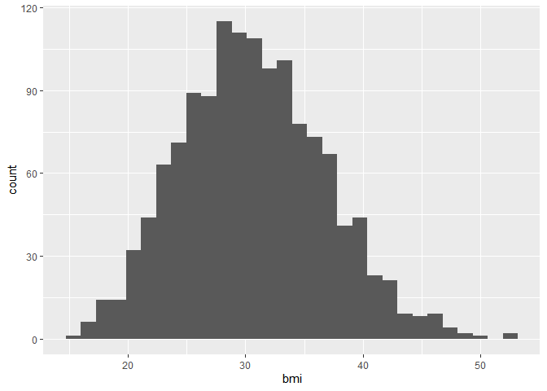

``` r
ggplot() +
  geom_histogram(data = ins_cost, 
       aes(x = charges), alpha = 0.5)
```

    ## `stat_bin()` using `bins = 30`. Pick better value with `binwidth`.

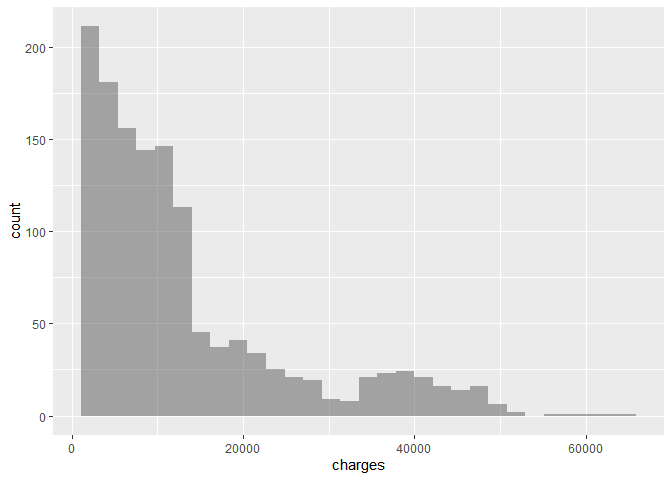

Задание 3

``` r
sr <- round(mean(ins_cost$charges), 2)
med <- round(median(ins_cost$charges), 2)
pl3 <- ggplot() +
  geom_density(data = ins_cost, aes(x = charges)) +
  theme_light() +
  geom_vline(aes(xintercept = sr), color = "blue") +
  geom_vline(aes(xintercept = med), color = "red") +
  annotate("text",
           x = sr + 5000,
           y = 5e-05,
           label = paste0("Mean = ", sr), color = "blue") +
  annotate("text",
           x = 10000,
           y = 0.5e-05,
           label = paste0("Median = ", med), color = "red") +
  labs(x = "расходы", y = "плотность")
```

Задание 4

``` r
pl41 <- ggplot() +
  geom_boxplot(data = ins_cost, 
               aes(x = charges, y = sex), color = 'blue', alpha = 0.8) +
  theme_minimal() +
  labs(y = 'пол', x = 'расходы') 


pl42 <- ggplot() +
  geom_boxplot(data = ins_cost, 
               aes(x = charges, y = smoker), fill = 'blue', alpha = 0.8) +
  theme_minimal() +
  labs(y = 'курение', x = 'расходы')


pl43 <- ggplot() +
  geom_boxplot(data = ins_cost, 
               aes(x = charges, y = region), color = 'blue', alpha = 0.8) +
  theme_minimal() +
  labs(y = 'регион', x = 'расходы') 
```

Задание 5

``` r
combine_pl4 <- ggarrange(pl41, pl42, pl43,
                       ncol = 3, nrow = 1 )
ggarrange(pl3, combine_pl4,
          ncol = 1, nrow = 2, labels = "вывод графиков", hjust = -10, vjust = 1)
```

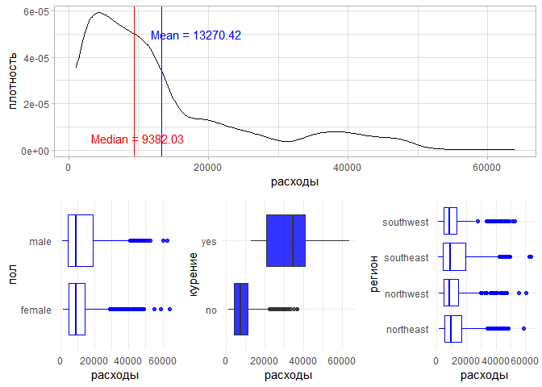

Задание 6

``` r
ggplot(data = ins_cost) +
  geom_density(aes(x = charges)) +
  theme_light() +
  geom_vline(aes(xintercept = sr), color = "blue") +
  geom_vline(aes(xintercept = med), color = "red") +
  annotate("text",
           x = sr + 5000,
           y = 5e-05,
           label = paste0("Mean = ", sr), color = "blue") +
  annotate("text",
           x = 10000,
           y = 0.5e-05,
           label = paste0("Median = ", med), color = "red") +
  labs(x = "расходы", y = "плотность") +
  facet_grid(vars(region))
```

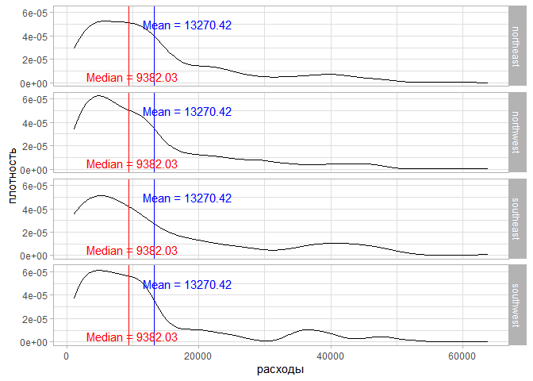

Задание 7

``` r
ggplot(ins_cost, aes(x=age, y=charges)) + 
  geom_point()  +
  theme_dark() +
  theme(axis.text.x = element_text(size=14) ) +
  ggtitle('Зависимость расходов от возраста') + 
  labs(y = 'расходы', x = 'возраст')  
```

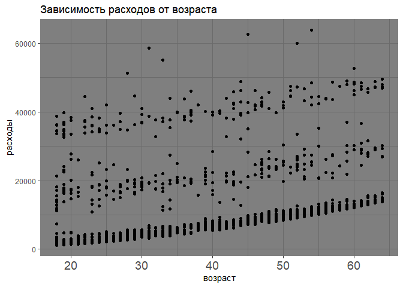

Задание 8

``` r
ggplot(ins_cost, aes(x=age, y=charges)) + 
  geom_point()  +
  theme_dark() +
  theme(axis.text.x = element_text(size=14) ) +
  ggtitle('Зависимость расходов от возраста') + 
  labs(y = 'расходы', x = 'возраст') +  
  geom_smooth(method=lm, 
              color="red", fullrange = T,
              fill="#69b3a2", 
              se=TRUE 
              )
```

    ## `geom_smooth()` using formula 'y ~ x'

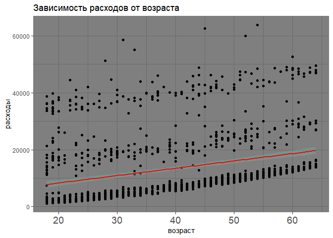

Задание 9

``` r
ggplot(ins_cost, aes(x=age, y=charges)) + 
  geom_point()  +
  theme_dark() +
  facet_grid(. ~ smoker) +
  theme(axis.text.x = element_text(size=14) ) +
  ggtitle('Зависимость расходов от возраста') + 
  labs(y = 'расходы', x = 'возраст') +  
  geom_smooth(method=lm, 
              color="red", fullrange = T,
              fill="#69b3a2", 
              se=TRUE 
              ) 
```

    ## `geom_smooth()` using formula 'y ~ x'

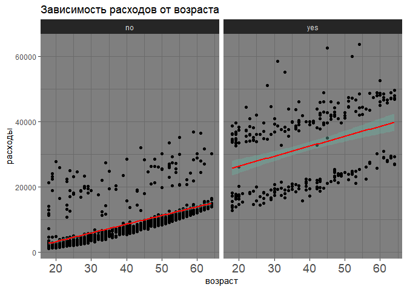

Задание 10

``` r
h1 <- ggplot(ins_cost, aes(x=bmi, y=charges)) + 
  geom_point()  +
  theme_dark() +
  theme(axis.text.x = element_text(size=14) ) +
  ggtitle('Зависимость расходов от ИМТ') + 
  labs(y = 'расходы', x = 'ИМТ')  

h2 <- ggplot(ins_cost, aes(x=bmi, y=charges)) + 
  geom_point()  +
  theme_dark() +
  theme(axis.text.x = element_text(size=14) ) +
  ggtitle('Зависимость расходов от ИМТ') + 
  labs(y = 'расходы', x = 'ИМТ') +  
  geom_smooth(method=lm, 
              color="red", fullrange = T,
              fill="#69b3a2", 
              se=TRUE 
              )

h3 <- ggplot(ins_cost, aes(x=bmi, y=charges)) + 
  geom_point()  +
  theme_dark() +
  facet_grid(. ~ smoker) +
  theme(axis.text.x = element_text(size=14) ) +
  ggtitle('Зависимость расходов от ИМТ') + 
  labs(y = 'расходы', x = 'ИМТ') +  
  geom_smooth(method=lm, 
              color="red", fullrange = T,
              fill="#69b3a2", 
              se=TRUE 
              ) 
ggarrange(h1, h2, h3)
```

    ## `geom_smooth()` using formula 'y ~ x'
    ## `geom_smooth()` using formula 'y ~ x'

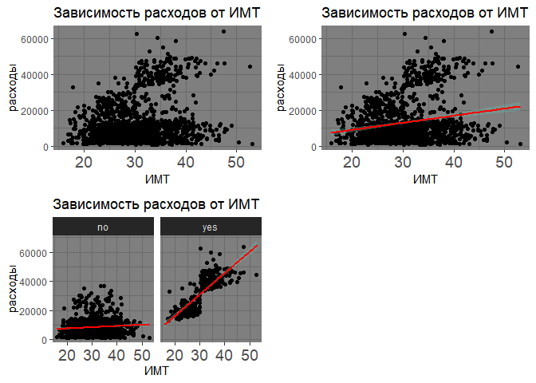

Задание 11

Зависит ли у женщин ИМТ от возраста? Указать линию тренда для различных регионов. (При ответе на данный вопрос необходимо использовать scatter plot, который позволяет увидеть распределение значений на графике и решить задачу с определением тенденции изменений)

``` r
ins_cost %>% 
  filter( sex == "female" ) %>%
  ggplot(aes(x=age, y=bmi)) + 
  geom_point(aes(color = region))  +
  theme_minimal() +
  facet_grid(. ~ region)  +
  ggtitle('Зависимость ИМТ женщин от возраста и региона') + 
  labs(x = 'возраст', y = 'ИМТ') +  
  geom_smooth(method=lm, 
              color="red", fullrange = T,
              fill="#69b3a2", 
              se=TRUE 
              ) 
```

    ## `geom_smooth()` using formula 'y ~ x'

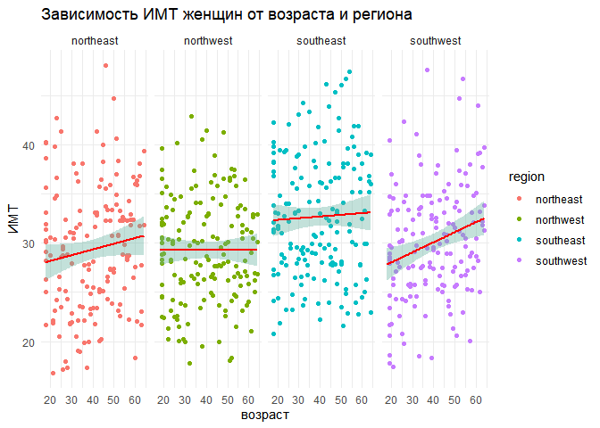

Задание 12

Как будут выглядеть графики плотности по возрасту для курящих мужчин с различным количеством детей? (Данный тип графика позволяет наглядно оценить распределение значений нескольких групп)

``` r
ins_cost <- ins_cost %>% 
  mutate(
    AmChil = case_when(
      children == 0 ~ "no",
      children == 1|  children == 2 ~ "some",
      children >= 3 ~ "a lot of"
    ))


ins_cost %>% 
  filter( smoker == "yes" & sex == "male" ) %>%
  ggplot() +
  ggtitle('График плотности для курящих мужчин с различным количеством детей') +
  geom_density(data = ins_cost, 
               aes(x = age, fill = AmChil), 
               alpha = 0.5 ) +
   labs(x = 'возраст') +
  theme_minimal()
```

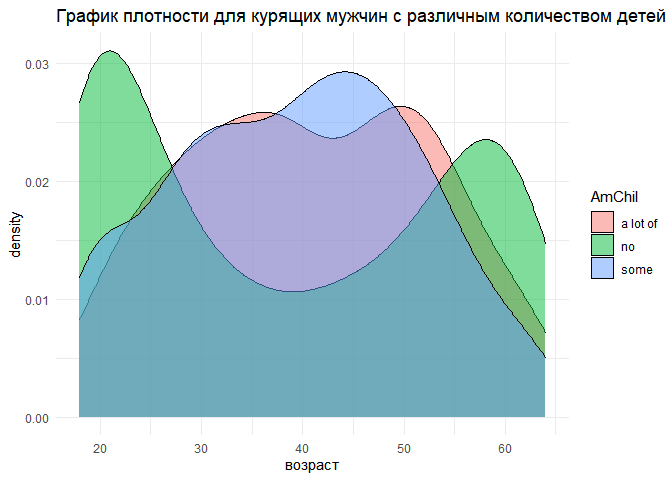

Задание 13

Влияет ли курение на ИМТ в северо-восточном регионе? (На данном графике оптимально сравнение значений числовой переменной в различных группах. Он позволяет сравнить квантили, разброс переменной и демонстрирует выбросы)

``` r
ins_cost %>% 
  filter( region == "northeast") %>%
  ggplot() +
  geom_boxplot(data = ins_cost, 
               aes(x = bmi, y = smoker), color = 'blue', alpha = 0.8) +
  theme_minimal() +  
  ggtitle('Влияние курения на ИМТ') +
  labs(y = 'курение', x = 'ИМТ') 
```

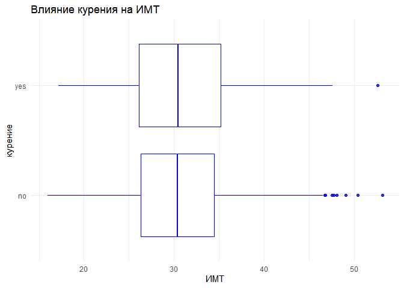

Задание 14

``` r
ins_cost %>% 
  filter( bmi != 0 & charges != 0 ) %>%
  ggplot( aes(x=bmi, y=charges)) + 
  geom_point(color="#993399")  +
  theme_minimal() +
  facet_grid(. ~ AmChil) +
  ggtitle('Зависимость расходов от bmi') + 
  labs(y = 'расходы', x = 'ИМТ') +  
  geom_smooth(method=lm, fullrange = T, 
              se=TRUE, 
              aes(color = AmChil) 
              )  +
  theme(legend.position = "bottom")
```

    ## `geom_smooth()` using formula 'y ~ x'

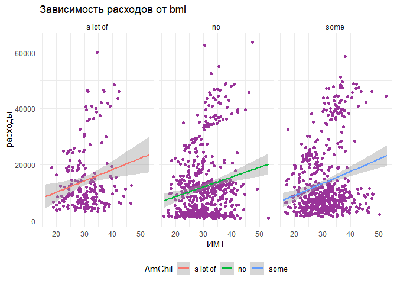
