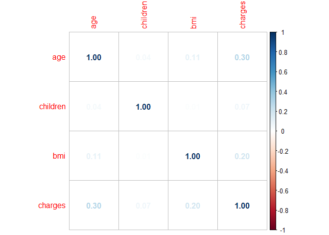
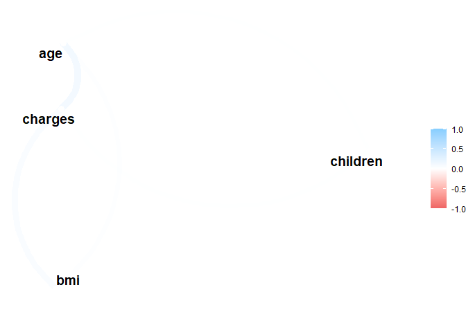
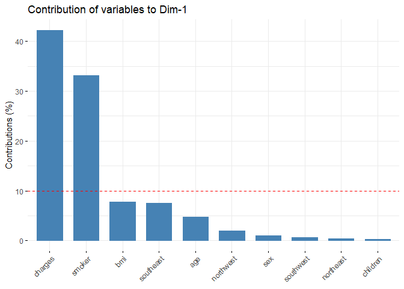

HW2
================
Маслова И
30 октября 2022 г

## Задание 1. Загрузим данные и пакеты

``` r
ins_cost <- read.csv('insurance_cost.csv')
library(dplyr)
```

    ## 
    ## Присоединяю пакет: 'dplyr'

    ## Следующие объекты скрыты от 'package:stats':
    ## 
    ##     filter, lag

    ## Следующие объекты скрыты от 'package:base':
    ## 
    ##     intersect, setdiff, setequal, union

``` r
library(ggplot2)
library(ggpubr)
library(plotly)
```

    ## 
    ## Присоединяю пакет: 'plotly'

    ## Следующий объект скрыт от 'package:ggplot2':
    ## 
    ##     last_plot

    ## Следующий объект скрыт от 'package:stats':
    ## 
    ##     filter

    ## Следующий объект скрыт от 'package:graphics':
    ## 
    ##     layout

``` r
library(corrplot)
```

    ## corrplot 0.92 loaded

``` r
library(corrr)
library(factoextra)
```

    ## Welcome! Want to learn more? See two factoextra-related books at https://goo.gl/ve3WBa

``` r
library(dendextend)
```

    ## 
    ## ---------------------
    ## Welcome to dendextend version 1.16.0
    ## Type citation('dendextend') for how to cite the package.
    ## 
    ## Type browseVignettes(package = 'dendextend') for the package vignette.
    ## The github page is: https://github.com/talgalili/dendextend/
    ## 
    ## Suggestions and bug-reports can be submitted at: https://github.com/talgalili/dendextend/issues
    ## You may ask questions at stackoverflow, use the r and dendextend tags: 
    ##   https://stackoverflow.com/questions/tagged/dendextend
    ## 
    ##  To suppress this message use:  suppressPackageStartupMessages(library(dendextend))
    ## ---------------------

    ## 
    ## Присоединяю пакет: 'dendextend'

    ## Следующий объект скрыт от 'package:ggpubr':
    ## 
    ##     rotate

    ## Следующий объект скрыт от 'package:stats':
    ## 
    ##     cutree

``` r
library(pheatmap)
library(ggbiplot)
```

    ## Загрузка требуемого пакета: plyr

    ## ------------------------------------------------------------------------------

    ## You have loaded plyr after dplyr - this is likely to cause problems.
    ## If you need functions from both plyr and dplyr, please load plyr first, then dplyr:
    ## library(plyr); library(dplyr)

    ## ------------------------------------------------------------------------------

    ## 
    ## Присоединяю пакет: 'plyr'

    ## Следующие объекты скрыты от 'package:plotly':
    ## 
    ##     arrange, mutate, rename, summarise

    ## Следующий объект скрыт от 'package:ggpubr':
    ## 
    ##     mutate

    ## Следующие объекты скрыты от 'package:dplyr':
    ## 
    ##     arrange, count, desc, failwith, id, mutate, rename, summarise,
    ##     summarize

    ## Загрузка требуемого пакета: scales

    ## Загрузка требуемого пакета: grid

``` r
library(FactoMineR)
```

## Задание 2

``` r
plot_ly(
  data = ins_cost[(ins_cost$bmi != 0) & (ins_cost$charges != 0),],
  x = ~ bmi,
  y = ~ charges,
  color = ~ smoker
)  
```

## Задание 3

``` r
plot <- ins_cost %>% 
  filter(bmi != 0 & charges != 0) %>% 
  ggplot(aes(x=bmi, y=charges, color = smoker)) + 
  geom_point(size=2) +
  theme_minimal()
plot
ggplotly(plot)
```

## Задание 4

 

Получение объекта матрицы:

``` r
ins_clear <- ins_cost %>% 
  filter(charges != 0 & bmi != 0 & age != 0) %>% 
  select(is.integer | is.numeric) 
head(ins_clear)
```

    ##   age children    bmi   charges
    ## 1  19        0 27.900 16884.924
    ## 2  18        1 33.770  1725.552
    ## 3  28        3 33.000  4449.462
    ## 4  33        0 22.705 21984.471
    ## 5  32        0 28.880  3866.855
    ## 6  31        0 25.740  3756.622

Получение непосредсвтенно самой матрицы

``` r
ins_cor <- cor(ins_clear)
```

Визуализируем её в corplot и corrr:

``` r
corrplot(ins_cor, method = 'number')
```



``` r
corrplot(ins_cor, method = 'square', diag = FALSE, order = 'hclust',
         addrect = 3, rect.col = 'blue', rect.lwd = 3, tl.pos = 'd')
```


``` r
corrplot(ins_cor, method = 'ellipse', order = 'AOE', type = 'upper')
```


``` r
ins_cor %>% 
  network_plot(min_cor = .0)
```



``` r
ins_cor %>% rplot( colors = c("red", "green"))
```


## Задание 5

``` r
ins_cost_d <- ins_cost %>% mutate(sex = as.integer(grepl(pattern = "female", sex)),
                     smoker = as.integer(grepl(pattern = "yes", smoker)),
                     southwest = as.integer(grepl(pattern = "southwest", region)),
                     northwest = as.integer(grepl(pattern = "northwest", region)),
                     northeast = as.integer(grepl(pattern = "northeast", region)),
                     southeast = as.integer(grepl(pattern = "southeast", region)))


ins_cost_numeric <- ins_cost_d[ , sapply(ins_cost_d, is.numeric)]
```

## Задание 6

``` r
ins_cost_scaled <- scale(ins_cost_numeric)  #стандартизируем значения
ins_cost_dist <- dist(ins_cost_scaled, method = "euclidean") #Создаём матрицу дистанций
as.matrix(ins_cost_dist)[1:6,1:6]
```

    ##          1        2        3        4        5        6
    ## 1 0.000000 4.878506 5.382420 4.785072 4.799844 4.318076
    ## 2 4.878506 0.000000 1.823634 4.289327 3.582563 2.702546
    ## 3 5.382420 1.823634 0.000000 4.663256 4.148789 3.414209
    ## 4 4.785072 4.289327 4.663256 0.000000 1.807952 4.124373
    ## 5 4.799844 3.582563 4.148789 1.807952 0.000000 3.840206
    ## 6 4.318076 2.702546 3.414209 4.124373 3.840206 0.000000

``` r
ins_cost_hc <- hclust(d = ins_cost_dist, 
                        method = "ward.D2")  #Высчитываем дендрограмму кластеров
fviz_dend(ins_cost_hc, 
          cex = 0.1, 
          k_colors = c("#2E9FDF", "#00AFBB", "#E7B800", "#FC4E07"),
          color_labels_by_k = TRUE, 
          rect = TRUE 
          ) #визуализация
```


## Задание 7.1-7.2

``` r
grp <- cutree(ins_cost_hc, k = 4)

fviz_cluster(list(data = ins_cost_scaled, cluster = grp),
             palette = c("#2E9FDF", "#00AFBB", "#E7B800", "#FC4E07"),
             ellipse.type = "convex", # Concentration ellipse
             repel = TRUE, # Avoid label overplotting (slow)
             show.clust.cent = FALSE, ggtheme = theme_minimal()) 
```


``` r
fviz_dend(ins_cost_hc, cex = 0.5, k = 4,
          k_colors = "jco", type = "circular") 
```


## Задание 7.3

``` r
hc1 <- hclust(ins_cost_dist, method = "average")
hc2 <- hclust(ins_cost_dist, method = "ward.D2")
# Create two dendrograms
dend1 <- as.dendrogram (hc1)
dend2 <- as.dendrogram (hc2)
# Create a list to hold dendrograms
dend_list <- dendlist(dend1, dend2)

tanglegram(dend1, dend2)
```


## Задание 8

``` r
pheatmap(ins_cost_scaled)
```


## Задание 9

``` r
ins_cost_full.pca <- prcomp(ins_cost_numeric, 
                        scale = T)
summary(ins_cost_full.pca)
```

    ## Importance of components:
    ##                           PC1    PC2    PC3    PC4    PC5    PC6    PC7     PC8
    ## Standard deviation     1.3939 1.2182 1.1510 1.1496 1.0403 1.0018 0.9767 0.86822
    ## Proportion of Variance 0.1943 0.1484 0.1325 0.1321 0.1082 0.1004 0.0954 0.07538
    ## Cumulative Proportion  0.1943 0.3427 0.4752 0.6073 0.7156 0.8159 0.9113 0.98669
    ##                            PC9    PC10
    ## Standard deviation     0.36478 5.1e-16
    ## Proportion of Variance 0.01331 0.0e+00
    ## Cumulative Proportion  1.00000 1.0e+00

``` r
fviz_eig(ins_cost_full.pca, 
         addlabels = T, 
         ylim = c(0, 40))
```


У нас в данных первые 4 главные компоненты объясняют 61% вариации данных. Первые две компоненты объясняют 34% дисперсии. Это не очень хороший результат.

``` r
fviz_pca_var(ins_cost_full.pca, col.var = "contrib") #посмотрим, как наши переменные связаны с PC1 и PC2.
```


По данной таблице мы уже можем сделать выводы, эффект каких переменных является наиболее выраженным.Также мы можем заметить, что наши переменные собираются в группы, две из которых являются противонаправленными, т.е. переменные отрицательно скоррелированы внутри представленных главных компонент. В данных мы видим четыре группы переменных:

1.  smoker, charges

2.  southeast, bmi

3.  northeast, northwest

4.  остальные

  Посмотрим, из чего состоят наши 1, 2 и 3 компоненты:

``` r
fviz_contrib(ins_cost_full.pca, choice = "var", axes = 1, top = 24) # 1
```



``` r
fviz_contrib(ins_cost_full.pca, choice = "var", axes = 2, top = 24) # 2
```


``` r
fviz_contrib(ins_cost_full.pca, choice = "var", axes = 3, top = 24) # 3
```


Как можно заметить, достаточно большой эффект имеют бинарные переменные. Charges и smoker больше всего определяют вариативность по первой главной компоненте. По второй - дамми southeast, а также bmi, northeast, по третьей - southwest.

 

Нанесем на график наблюдения, разделим их на группы. Визуализируем полученные нами до этого момента данные.

``` r
ggbiplot(ins_cost_full.pca, 
         scale=0, 
         groups = as.factor(ins_cost$smoker), 
         ellipse = T,
         alpha = 0.2) +
  theme_minimal()
```


Выделенные области, очевидно, коррелирую с smoker и явно разделены на группы, хоть некоторые наблюдения и находятся вне областей.

 

## Задание 10

``` r
ins_cost <- ins_cost %>% 
  mutate(
    age_group = case_when(
      age < 31 ~ "21-30",
      age >= 31 & age < 41 ~ "31-40",
      age >= 41 & age < 51 ~ "41-50",
      age >= 51 & age < 61 ~ "51-60",
      age >= 61 ~ "60+"
    ))

ggbiplot(ins_cost_full.pca, 
         scale=0, 
         groups = as.factor(ins_cost$age_group), 
         ellipse = T,
         alpha = 0.2) +
  theme_minimal()
```


Данный график визуализирует, как и ожидалось, что age имеет не столь большой эффект. Наблюдения смешиваются и выходят за рамки выделенных областей.

 

## Задание 11

``` r
ins_cost <- ins_cost %>% 
  mutate(
    money = case_when(
      charges < 10000 ~ "0",
      charges >= 10000 & charges < 25000 ~ "1",
      charges >= 25000 & age < 40000 ~ "2",
      charges >= 40000 ~ "3"
    ))

ggbiplot(ins_cost_full.pca, 
         scale=0, 
         groups = as.factor(ins_cost$money), 
         ellipse = T,
         alpha = 0.2) +
  theme_minimal()
```


``` r
ins_cost <- ins_cost %>% 
  mutate(
    northern_region = case_when(
      region == "northwest" | region == "northeast" ~ "1",
      region == "southwest" | region == "southeast" ~ "0"
    ))

ggbiplot(ins_cost_full.pca, 
         scale=0, 
         groups = as.factor(ins_cost$northern_region), 
         ellipse = T,
         alpha = 0.2) +
  theme_minimal()
```


