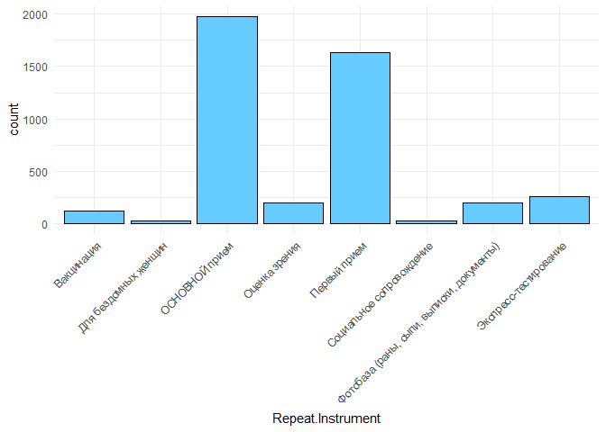
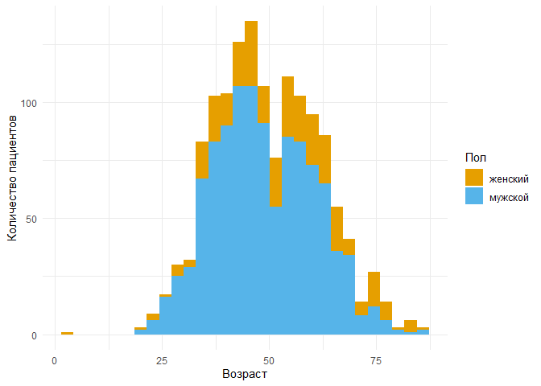
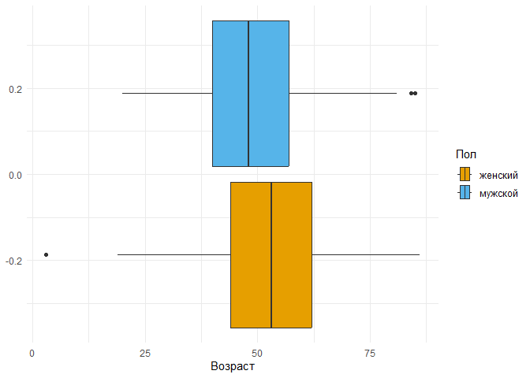
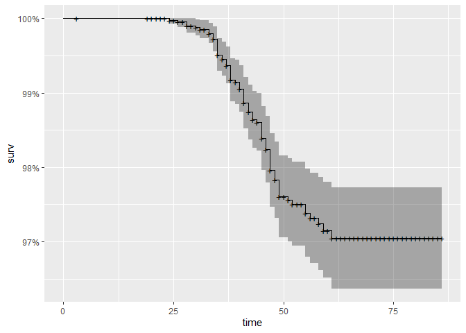
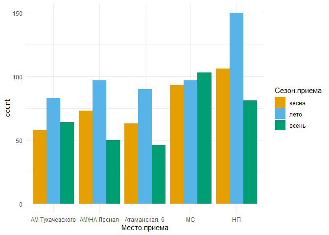
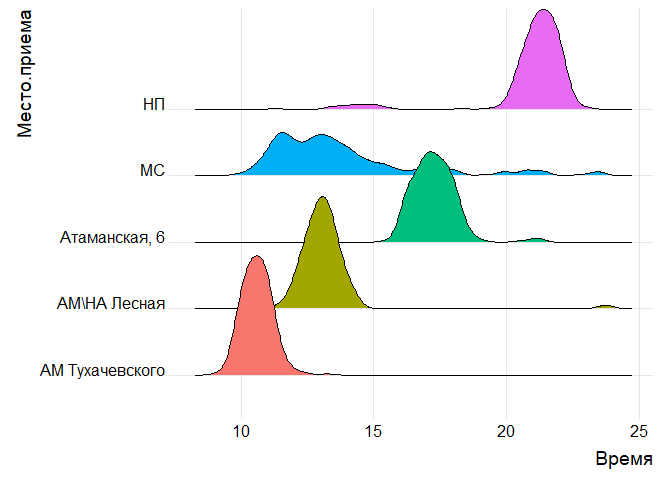
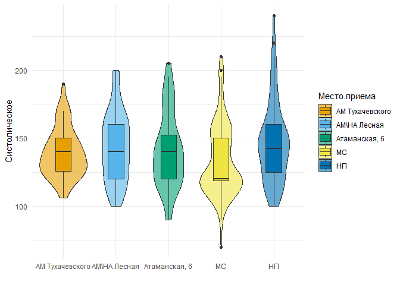
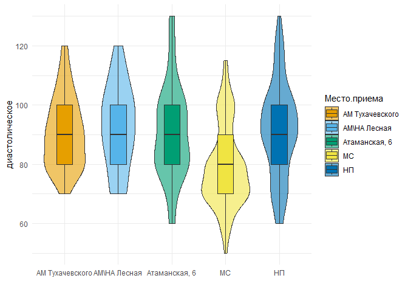
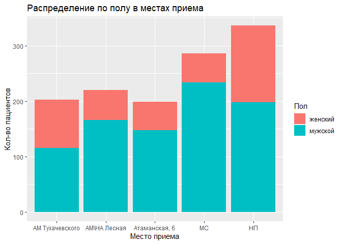

конечный
================
Маслова И
2023-01-26

    ## New names:
    ## New names:
    ## New names:
    ## New names:
    ## New names:
    ## New names:
    ## New names:
    ## New names:
    ## * `` -> `...1`

Charity hospital is a non-profit organization that provides medical and
social assistance to homeless people in Saint Petersburg. Volunteer
doctors consult patients, vaccinate them, provide them with glasses,
etc. Since 2021, the REDCap electronic data capture system has been
collecting information about all the Charity hospital patients. The aim
of this study was to analyze the patient database of the Charity
hospital which contains information about 1633 unique patients and 4427
visits.

Objectives: 1. to prepare data for the analysis 2. to create the report
with descriptive statistics 3. to create a universal portrait of the
homeless person 4. to find relationship between place of appointment and
other variables 5. to analyze HIV-positive population distinctly 6. to
search for indicators on which the call to the ambulance depends

\#Descriptive statistics and a universal portrait of the homeless person

<!-- -->

# Факторный анализ

    ## `stat_bin()` using `bins = 30`. Pick better value with `binwidth`.

<!-- --><!-- -->

# Анализ зрения

    ## `stat_bin()` using `bins = 30`. Pick better value with `binwidth`.

<!-- -->

# ВИЧ

<!-- -->

### ВИЧ GLM

### MODEL вич

созд дф трен

    ## PhantomJS not found. You can install it with webshot::install_phantomjs(). If it is installed, please make sure the phantomjs executable can be found via the PATH variable.

### MODEL гепатит С

созд дф трен

    ## PhantomJS not found. You can install it with webshot::install_phantomjs(). If it is installed, please make sure the phantomjs executable can be found via the PATH variable.

—————-КРАМЕРА

To search for indicators on which the call to the emergency medical
services to the patient depends, we used Cramér’s V for nominal
variables. Regression analysis was unavailable due to lack of data.  
To calculate the strength of association, we built a table, the values
of which were then divided into three categories: weak, moderate and
strong connection. No strong association between the variables was
found. A moderate association was observed between hospitalization and
the following variables: complaints, edema (anasarca), vomiting
(uncontrollable), SpO2 saturation.

    ##                                                                                                                                                                                 Переменная
    ## Cramer V...1                                                                                                                                                                  Сезон.приема
    ## Cramer V...2                                                                                                                                                                       Жалобы2
    ## Cramer V...3                                                                                                                                                                       Жалобы1
    ## Cramer V...4                                                                                                                                                                   Complete..3
    ## Cramer V...5                                                                                             Пациенту.выдано...choice.средства.интимной.гигиены..прокладки..тампоны..комплект.
    ## Cramer V...6                                                                                                                                Пациенту.выдано...choice.тест.на.беременность.
    ## Cramer V...7                                                                                                                                      Пациенту.выдано...choice.трость.костыль.
    ## Cramer V...8                                                                                                                                Пациенту.выдано...choice.SIM.карта.к.телефону.
    ## Cramer V...9                                                                                                                                   Пациенту.выдано...choice.мобильный.телефон.
    ## Cramer V...10                                                                                                                                           Пациенту.выдано...choice.спальник.
    ## Cramer V...11                                                                                                                                        Пациенту.выдано...choice.лайфпак.М.Ж.
    ## Cramer V...12                                                                                                                                       Пациенту.выдано...choice.БСК.на.метро.
    ## Cramer V...13                                                                                                                                     Пациенту.выдано...choice.жетон.на.метро.
    ## Cramer V...14                                                                                                                         Пациенту.выдано...choice.консультативное.заключение.
    ## Cramer V...15                                                                                                                                  Пациенту.выдано...choice.справка.ББ.с.фото.
    ## Cramer V...16                                                                                                                                Пациенту.выдано...choice.направление.ф.057.у.
    ## Cramer V...17                                                                                                                      Пациенту.выдано...choice.согласие.на.медицинскую.тайну.
    ## Cramer V...18                                                                                                                                    Наши.действия..choice.выдаем.медикаменты.
    ## Cramer V...19                                                                                                                  Наши.действия..choice.оцениваем.остроту.зрения.выдаем.очки.
    ## Cramer V...20                                                                                                                                    Наши.действия..choice.проводим.перевязку.
    ## Cramer V...21                                                                                                                                           Наши.действия..choice.вакцинируем.
    ## Cramer V...22                                                                                                                                 Наши.действия..choice.тестируем.на.инфекции.
    ## Cramer V...23                                                                                                                                     Наши.действия..choice.ведем.амбулаторно.
    ## Cramer V...24                                                                                                                                                         Диагноз.по.МКБ.10..2
    ## Cramer V...25                                                                                                                                                         Диагноз.по.МКБ.10..1
    ## Cramer V...26                                                                                                                                                      Отеки..choice.анасарка.
    ## Cramer V...27                                                                                                                                           Отеки..choice.пастозность.голеней.
    ## Cramer V...28                                                                                                                                  Физиологические.отправления..choice.диарея.
    ## Cramer V...29                                                                                                                        Физиологические.отправления..choice.признаки.дизурии.
    ## Cramer V...30                                                                                            Физиологические.отправления..choice.мочеиспускание.не.нарушено..стул.оформленный.
    ## Cramer V...31                                                                                                                                                 Рвота..choice.с.алой.кровью.
    ## Cramer V...32                                                                                                                             Рвота..choice.съеденной.пищей.без.пат..примесей.
    ## Cramer V...33                                                                                                                                                    Рвота..choice.однократно.
    ## Cramer V...34                                                                                                                                                   Рвота..choice.неукротимая.
    ## Cramer V...35                                                                                                                                                                        Хрипы
    ## Cramer V...36                                                                                                                                                       Аускультативно.дыхание
    ## Cramer V...37                                                                                                                                         Мокрота..choice.обильное.количество.
    ## Cramer V...38                                                                                                                                        Мокрота..choice.умеренное.количество.
    ## Cramer V...39                                                                                                                                          Мокрота..choice.скудное.количество.
    ## Cramer V...40                                                                                                                                            Мокрота..choice.слизисто.гнойная.
    ## Cramer V...41                                                                                                                                                     Мокрота..choice.гнойная.
    ## Cramer V...42                                                                                                                                                   Мокрота..choice.слизистая.
    ## Cramer V...43                                                                                                                                    Кашель..choice.мучительный..нарушает.сон.
    ## Cramer V...44                                                                                                                                      Кашель..choice.постоянно.в.течение.дня.
    ## Cramer V...45                                                                                                                                        Кашель..choice.преимущественно.утром.
    ## Cramer V...46                                                                                                                                             Кашель..choice.приступообразный.
    ## Cramer V...47                                                                                                                                        Кашель..choice.влажный..продуктивный.
    ## Cramer V...48                                                                                                                                      Кашель..choice.сухой..малопродуктивный.
    ## Cramer V...49                                                                                                                                                               Грудная.клетка
    ## Cramer V...50                                                                                                                                                            Дыхание.через.нос
    ## Cramer V...51                                                                                                                                                         Налеты.на.миндалинах
    ## Cramer V...52                                                                                                                                                         Слизистая.ротоглотки
    ## Cramer V...53                                                                                                                                                             Сатурация..SpO2.
    ## Cramer V...54                                                                                                                      Жалобы..nbsp...choice.жалоб.не.предъявляет.иные.жалобы.
    ## Cramer V...55                                                                                                                                                  Жалобы..nbsp...choice.рана.
    ## Cramer V...56                                                                                                                                                  Жалобы..nbsp...choice.сыпь.
    ## Cramer V...57                                                                                                                                         Жалобы..nbsp...choice.острая.травма.
    ## Cramer V...58                                                                                                                                       Жалобы..nbsp...choice.болевой.синдром.
    ## Cramer V...59                                                                                                                                   Жалобы..nbsp...choice.эндокринная.система.
    ## Cramer V...60                                                                                                                                                Жалобы..nbsp...choice.зрение.
    ## Cramer V...61                                                                                                                   Жалобы..nbsp...choice.ЦНС.психиатрия.ментальные.нарушения.
    ## Cramer V...62                                                                                                                           Жалобы..nbsp...choice.опорно.двигательная.система.
    ## Cramer V...63                                                                                                                                   Жалобы..nbsp...choice.мочеполовая.система.
    ## Cramer V...64                                                                                                                     Жалобы..nbsp...choice.сердечно.сосудистая.система..ССС..
    ## Cramer V...65                                                                                                                        Жалобы..nbsp...choice.желудочно.кишечный.тракт..ЖКТ..
    ## Cramer V...66                                                                                                                                   Жалобы..nbsp...choice.дыхательная.система.
    ## Cramer V...67                                                                                                                                       Опьянение..алкогольное..наркотическое.
    ## Cramer V...68 Вы.ассистент...то.есть.не.врач..человек..не.имеющий.возможности.в.силу.своей.квалификации.принимать.медицинские.решения.о.здоровье.пациента.и.нести.за.них.ответственность..
    ## Cramer V...69                                                                                                                         Где.ночует.пациент.сегодня...или.где.ночевал.вчера..
    ## Cramer V...70                                                                                                                                                                 Место.приема
    ## Cramer V...71                                                                                                                                                                          Пол
    ## Cramer V...72                                                                                                                                                              Repeat.Instance
    ##               Значение     Результат
    ## Cramer V...1  0.006820  слабая связь
    ## Cramer V...2  0.239100 средняя связь
    ## Cramer V...3  0.132900  слабая связь
    ## Cramer V...4  0.053570  слабая связь
    ## Cramer V...5  0.010250  слабая связь
    ## Cramer V...6  0.004454  слабая связь
    ## Cramer V...7  0.004454  слабая связь
    ## Cramer V...8  0.003148  слабая связь
    ## Cramer V...9  0.004454  слабая связь
    ## Cramer V...10 0.004454  слабая связь
    ## Cramer V...11 0.146500  слабая связь
    ## Cramer V...12 0.110900  слабая связь
    ## Cramer V...13 0.066030  слабая связь
    ## Cramer V...14 0.020710  слабая связь
    ## Cramer V...15 0.002225  слабая связь
    ## Cramer V...16 0.237400 средняя связь
    ## Cramer V...17 0.271000 средняя связь
    ## Cramer V...18 0.104200  слабая связь
    ## Cramer V...19 0.016100  слабая связь
    ## Cramer V...20 0.035110  слабая связь
    ## Cramer V...21 0.022830  слабая связь
    ## Cramer V...22 0.026910  слабая связь
    ## Cramer V...23 0.194400  слабая связь
    ## Cramer V...24 0.139600  слабая связь
    ## Cramer V...25 0.094140  слабая связь
    ## Cramer V...26 0.228400 средняя связь
    ## Cramer V...27 0.010730  слабая связь
    ## Cramer V...28 0.035210  слабая связь
    ## Cramer V...29 0.009212  слабая связь
    ## Cramer V...30 0.017040  слабая связь
    ## Cramer V...31 0.002225  слабая связь
    ## Cramer V...32 0.129300  слабая связь
    ## Cramer V...33 0.003148  слабая связь
    ## Cramer V...34 0.228400 средняя связь
    ## Cramer V...35 0.083110  слабая связь
    ## Cramer V...36 0.165700  слабая связь
    ## Cramer V...37 0.003148  слабая связь
    ## Cramer V...38 0.005896  слабая связь
    ## Cramer V...39 0.040330  слабая связь
    ## Cramer V...40 0.011420  слабая связь
    ## Cramer V...41 0.003856  слабая связь
    ## Cramer V...42 0.008449  слабая связь
    ## Cramer V...43 0.066030  слабая связь
    ## Cramer V...44 0.005896  слабая связь
    ## Cramer V...45 0.007399  слабая связь
    ## Cramer V...46 0.004981  слабая связь
    ## Cramer V...47 0.016420  слабая связь
    ## Cramer V...48 0.054620  слабая связь
    ## Cramer V...49 0.012720  слабая связь
    ## Cramer V...50 0.076880  слабая связь
    ## Cramer V...51 0.018520  слабая связь
    ## Cramer V...52 0.027230  слабая связь
    ## Cramer V...53 0.400300 сильная связь
    ## Cramer V...54 0.007705  слабая связь
    ## Cramer V...55 0.044200  слабая связь
    ## Cramer V...56 0.012480  слабая связь
    ## Cramer V...57 0.023250  слабая связь
    ## Cramer V...58 0.008673  слабая связь
    ## Cramer V...59 0.007052  слабая связь
    ## Cramer V...60 0.018950  слабая связь
    ## Cramer V...61 0.029340  слабая связь
    ## Cramer V...62 0.023270  слабая связь
    ## Cramer V...63 0.011200  слабая связь
    ## Cramer V...64 0.011950  слабая связь
    ## Cramer V...65 0.040250  слабая связь
    ## Cramer V...66 0.090580  слабая связь
    ## Cramer V...67 0.047830  слабая связь
    ## Cramer V...68 0.021680  слабая связь
    ## Cramer V...69 0.101200  слабая связь
    ## Cramer V...70 0.110500  слабая связь
    ## Cramer V...71 0.013490  слабая связь
    ## Cramer V...72 0.092050  слабая связь

# ДРУГОЕ

# Анализ МС (место приема)

категор

колич

для возраста

# Анализ НП (место приема)

категор

колич

для возраста

<!-- -->

<!-- -->

анализ времемни

    ##          Значения 10-11 11-12 12-13 13-14 14-15 15-16 17-18 18-19 19-20 20-21
    ## 1 АМ Тухачевского   131    39     2     1     0     0     0     0     0     0
    ## 2   АМ\\НА Лесная     0     9    93    99    12     0     0     0     0     0
    ## 3   Атаманская, 6     0     0     0     0     0     2    75    88    22     1
    ## 4              МС    15    62    50    53    31    18     8    10     4     9
    ## 5              НП     0     1     0     4    11     4     0     0     1    84
    ##   21-22 22-23 23-24 9-10
    ## 1     0     0     0   30
    ## 2     0     0     3    0
    ## 3     3     0     0    0
    ## 4     5     1     5    2
    ## 5   180    39     1    0

<!-- -->

    ## Picking joint bandwidth of 0.278

<!-- -->

    ## .
    ## 10-11 11-12 12-13 13-14 14-15 15-16 17-18 18-19 19-20 20-21 21-22 22-23 23-24 
    ##   152   115   157   162    59    27   102   121    98   350   247    55    14 
    ##  9-10  до 9 
    ##    35    12

# Давление сист

тест

    ## # A tibble: 5 x 2
    ##   Место.приема      Систолическое
    ##   <fct>                     <dbl>
    ## 1 "АМ Тухачевского"    0.0185    
    ## 2 "АМ\\НА Лесная"      0.100     
    ## 3 "Атаманская, 6"      0.106     
    ## 4 "МС"                 0.00000149
    ## 5 "НП"                 0.000763

    ## [1] 0.00473854

    ## # A tibble: 10 x 9
    ##    .y.           group1       group2    n1    n2 stati~1       p   p.adj p.adj~2
    ##  * <chr>         <chr>        <chr>  <int> <int>   <dbl>   <dbl>   <dbl> <chr>  
    ##  1 Систолическое "АМ Тухачев~ "АМ\\~    47    45   0.567 5.71e-1 1       ns     
    ##  2 Систолическое "АМ Тухачев~ "Атам~    47    40  -0.126 8.99e-1 1       ns     
    ##  3 Систолическое "АМ Тухачев~ "МС"      47   138  -1.90  5.72e-2 0.458   ns     
    ##  4 Систолическое "АМ Тухачев~ "НП"      47    86   0.859 3.90e-1 1       ns     
    ##  5 Систолическое "АМ\\НА Лес~ "Атам~    45    40  -0.669 5.03e-1 1       ns     
    ##  6 Систолическое "АМ\\НА Лес~ "МС"      45   138  -2.56  1.05e-2 0.0944  ns     
    ##  7 Систолическое "АМ\\НА Лес~ "НП"      45    86   0.205 8.38e-1 1       ns     
    ##  8 Систолическое "Атаманская~ "МС"      40   138  -1.64  1.02e-1 0.711   ns     
    ##  9 Систолическое "Атаманская~ "НП"      40    86   0.957 3.39e-1 1       ns     
    ## 10 Систолическое "МС"         "НП"     138    86   3.47  5.16e-4 0.00516 **     
    ## # ... with abbreviated variable names 1: statistic, 2: p.adj.signif

<!-- -->

диаст

    ## # A tibble: 5 x 2
    ##   Место.приема      диастолическое
    ##   <fct>                      <dbl>
    ## 1 "АМ Тухачевского"    0.00618    
    ## 2 "АМ\\НА Лесная"      0.0469     
    ## 3 "Атаманская, 6"      0.0342     
    ## 4 "МС"                 0.000000267
    ## 5 "НП"                 0.00757

    ## [1] 3.028218e-11

    ## # A tibble: 10 x 9
    ##    .y.            group1      group2    n1    n2 stati~1       p   p.adj p.adj~2
    ##  * <chr>          <chr>       <chr>  <int> <int>   <dbl>   <dbl>   <dbl> <chr>  
    ##  1 диастолическое "АМ Тухаче~ "АМ\\~    47    43  0.461  6.45e-1 1   e+0 ns     
    ##  2 диастолическое "АМ Тухаче~ "Атам~    47    40 -0.181  8.57e-1 1   e+0 ns     
    ##  3 диастолическое "АМ Тухаче~ "МС"      47   138 -4.70   2.62e-6 2.09e-5 ****   
    ##  4 диастолическое "АМ Тухаче~ "НП"      47    85  0.0146 9.88e-1 1   e+0 ns     
    ##  5 диастолическое "АМ\\НА Ле~ "Атам~    43    40 -0.620  5.35e-1 1   e+0 ns     
    ##  6 диастолическое "АМ\\НА Ле~ "МС"      43   138 -5.10   3.38e-7 3.04e-6 ****   
    ##  7 диастолическое "АМ\\НА Ле~ "НП"      43    85 -0.506  6.13e-1 1   e+0 ns     
    ##  8 диастолическое "Атаманска~ "МС"      40   138 -4.20   2.64e-5 1.85e-4 ***    
    ##  9 диастолическое "Атаманска~ "НП"      40    85  0.217  8.28e-1 1   e+0 ns     
    ## 10 диастолическое "МС"        "НП"     138    85  5.77   7.71e-9 7.71e-8 ****   
    ## # ... with abbreviated variable names 1: statistic, 2: p.adj.signif

<!-- -->

<!-- --><!-- -->

# Вакцинация

Вакцинация
