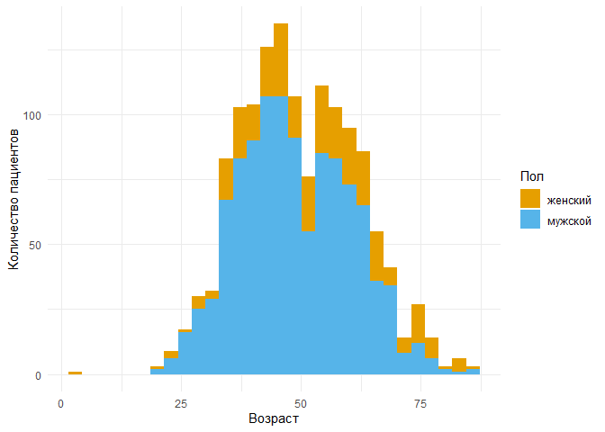
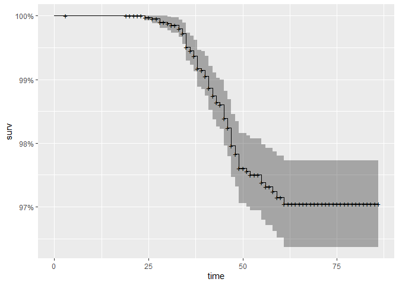
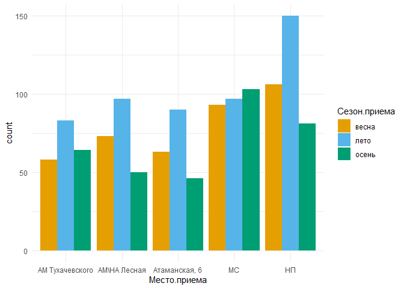
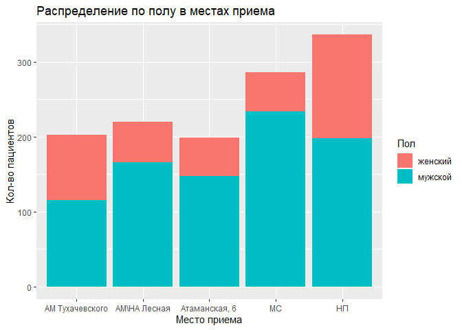

конечный
================
Authors: 
I. Maslova
I. Tsepeleva
A. Bydanov
P. Pchelintseva
E.Tomilov

# Introduction

Charity hospital is a non-profit organization that provides medical and
social assistance to homeless people in Saint Petersburg. Volunteer
doctors consult patients, vaccinate them, provide them with glasses,
etc. Since 2021, the REDCap electronic data capture system has been
collecting information about all the Charity hospital patients. The aim
of this study was to analyze the patient database of the Charity
hospital which contains information about 1633 unique patients and 4427
visits.

# Objectives: 
1. to prepare data for the analysis 
2. to create the report
with descriptive statistics 
3. to create a universal portrait of the
homeless person 
4. to find relationship between place of appointment and
other variables 
5. to analyze HIV-positive population distinctly 
6. to search for indicators on which the call to the ambulance depends

# Descriptive statistics and a universal portrait of the homeless person
Visit analysis.
We were provided with data on 1633 unique patients. Patients had the following goals for the visit:
-first appointment (mandatory for all)  
-main appointment  
-vaccination  
-for homeless women   
-vision assessment  
-social support  
-photobase (wounds, rashes, extracts, documents)  
-express testing  
The mode for each of the categories was equal to one (most often, patients for any purpose came only once). Some patients had a large number of visits for the same purpose. Thus, the maximum number of main appointments for one person was 35, maximum number of the reception for the photobase - 18. The other categories did not have such high rates.

<!-- -->

## A universal portrait of the homeless person

One of the objectives of our project is to draw up a universal portrait of a homeless person. The analysis carried out showed the following results: most people without a fixed place of residence who applied to ANO "Charity Hospital" are male, with Russian citizenship, have a basic set of documents (Passport, SNILS, compulsory medical insurance policy), have a permanent registration or do not have it at all. For the majority of patients, consent to the processing of personal data was not filled out at the first appointment. Most patients do not have socially significant diseases, allergies, but have bad habits (nicotine and alcohol addiction). Of the diseases, the most common are diseases of the skin and subcutaneous tissue, diseases of the musculoskeletal system and connective tissue, diseases of the respiratory system, diseases of the digestive system and diseases of the circulatory system. Patients are mostly unmarried. Approximately equally there were patients who were and were not in places of detention. 

<!-- --><!-- -->

# Анализ зрения

Также были проанализированы данные по остроте зрения бездомных. Исследование зрения было проведено 111 пациентам. У 74% из них выявлена дальнозоркость. Наиболее востребованы стали очки на 2,5 диоптрий, поэтому их в филиалах “Благотворительной больницы” мы советуем держать про запас.

    ## `stat_bin()` using `bins = 30`. Pick better value with `binwidth`.

<!-- -->

# HIV
We conducted an analysis of HIV-infected people. Among all patients included in the database, 87 people were infected with HIV. Of these, 53 are registered. Every year the chance of contracting HIV decreases by 0.94 times compared to the previous year. The male gender also reduces the chance to be infected by 0.3 times. The presence of diagnosed hepatitis C increases the chance by 3 times, and hepatitis B - by 5 times. 

<!-- -->

# Hepatitis C

 A similar regression analysis was carried out to search for associations with Hepatitis C. It was found that every year the chance of infection with hepatitis C decreases by 0.96 times, relative to the previous year. Gender in this case does not play a significant role, p-value>0.05. At the same time, the presence of HIV infection increases the chance to be infected by 3 times, and hepatitis B by 10 times.
# Cramer\`s V

To search for indicators on which the call to the emergency medical
services to the patient depends, we used Cramér’s V for nominal
variables. Regression analysis was unavailable due to lack of data.  
To calculate the strength of association, we built a table, the values
of which were then divided into three categories: weak, moderate and
strong connection. No strong association between the variables was
found. A moderate association was observed between hospitalization and
the following variables: complaints, edema (anasarca), vomiting
(uncontrollable), SpO2 saturation.

# ДРУГОЕ

# Анализ МС (место приема)

категор

колич

для возраста

# Анализ НП (место приема)

категор

колич

для возраста

<!-- -->

<!-- -->

анализ времемни

<!-- -->

    ## Picking joint bandwidth of 0.278

<!-- -->

    ## .
    ## 10-11 11-12 12-13 13-14 14-15 15-16 17-18 18-19 19-20 20-21 21-22 22-23 23-24 
    ##   152   115   157   162    59    27   102   121    98   350   247    55    14 
    ##  9-10  до 9 
    ##    35    12

# Давление сист

тест

    ## # A tibble: 5 x 2
    ##   Место.приема      Систолическое
    ##   <fct>                     <dbl>
    ## 1 "АМ Тухачевского"    0.0185    
    ## 2 "АМ\\НА Лесная"      0.100     
    ## 3 "Атаманская, 6"      0.106     
    ## 4 "МС"                 0.00000149
    ## 5 "НП"                 0.000763

    ## [1] 0.00473854

    ## # A tibble: 10 x 9
    ##    .y.           group1       group2    n1    n2 stati~1       p   p.adj p.adj~2
    ##  * <chr>         <chr>        <chr>  <int> <int>   <dbl>   <dbl>   <dbl> <chr>  
    ##  1 Систолическое "АМ Тухачев~ "АМ\\~    47    45   0.567 5.71e-1 1       ns     
    ##  2 Систолическое "АМ Тухачев~ "Атам~    47    40  -0.126 8.99e-1 1       ns     
    ##  3 Систолическое "АМ Тухачев~ "МС"      47   138  -1.90  5.72e-2 0.458   ns     
    ##  4 Систолическое "АМ Тухачев~ "НП"      47    86   0.859 3.90e-1 1       ns     
    ##  5 Систолическое "АМ\\НА Лес~ "Атам~    45    40  -0.669 5.03e-1 1       ns     
    ##  6 Систолическое "АМ\\НА Лес~ "МС"      45   138  -2.56  1.05e-2 0.0944  ns     
    ##  7 Систолическое "АМ\\НА Лес~ "НП"      45    86   0.205 8.38e-1 1       ns     
    ##  8 Систолическое "Атаманская~ "МС"      40   138  -1.64  1.02e-1 0.711   ns     
    ##  9 Систолическое "Атаманская~ "НП"      40    86   0.957 3.39e-1 1       ns     
    ## 10 Систолическое "МС"         "НП"     138    86   3.47  5.16e-4 0.00516 **     
    ## # ... with abbreviated variable names 1: statistic, 2: p.adj.signif

<!-- -->

диаст

    ## # A tibble: 5 x 2
    ##   Место.приема      диастолическое
    ##   <fct>                      <dbl>
    ## 1 "АМ Тухачевского"    0.00618    
    ## 2 "АМ\\НА Лесная"      0.0469     
    ## 3 "Атаманская, 6"      0.0342     
    ## 4 "МС"                 0.000000267
    ## 5 "НП"                 0.00757

    ## [1] 3.028218e-11

    ## # A tibble: 10 x 9
    ##    .y.            group1      group2    n1    n2 stati~1       p   p.adj p.adj~2
    ##  * <chr>          <chr>       <chr>  <int> <int>   <dbl>   <dbl>   <dbl> <chr>  
    ##  1 диастолическое "АМ Тухаче~ "АМ\\~    47    43  0.461  6.45e-1 1   e+0 ns     
    ##  2 диастолическое "АМ Тухаче~ "Атам~    47    40 -0.181  8.57e-1 1   e+0 ns     
    ##  3 диастолическое "АМ Тухаче~ "МС"      47   138 -4.70   2.62e-6 2.09e-5 ****   
    ##  4 диастолическое "АМ Тухаче~ "НП"      47    85  0.0146 9.88e-1 1   e+0 ns     
    ##  5 диастолическое "АМ\\НА Ле~ "Атам~    43    40 -0.620  5.35e-1 1   e+0 ns     
    ##  6 диастолическое "АМ\\НА Ле~ "МС"      43   138 -5.10   3.38e-7 3.04e-6 ****   
    ##  7 диастолическое "АМ\\НА Ле~ "НП"      43    85 -0.506  6.13e-1 1   e+0 ns     
    ##  8 диастолическое "Атаманска~ "МС"      40   138 -4.20   2.64e-5 1.85e-4 ***    
    ##  9 диастолическое "Атаманска~ "НП"      40    85  0.217  8.28e-1 1   e+0 ns     
    ## 10 диастолическое "МС"        "НП"     138    85  5.77   7.71e-9 7.71e-8 ****   
    ## # ... with abbreviated variable names 1: statistic, 2: p.adj.signif

<!-- -->

<!-- --><!-- -->

# Вакцинация

Вакцинация
